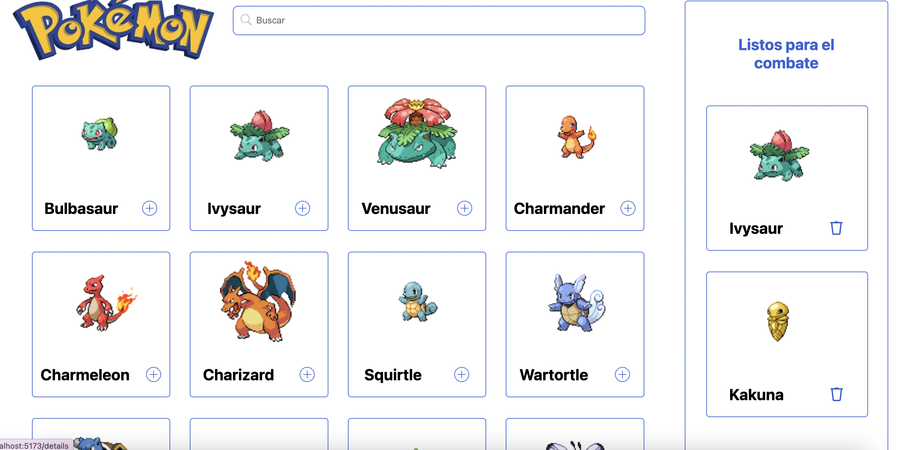
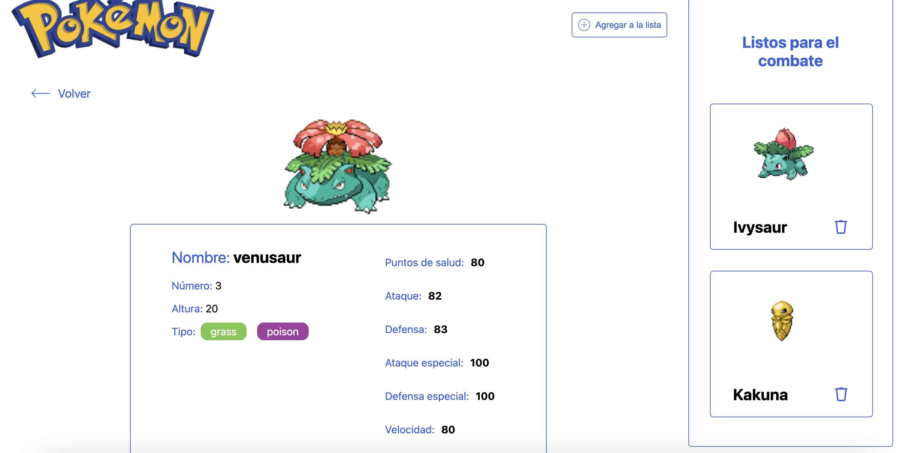
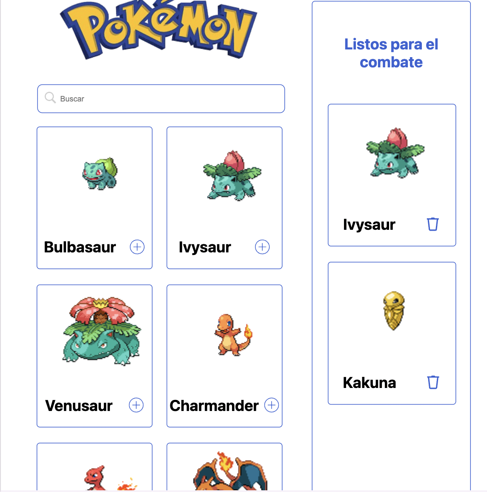
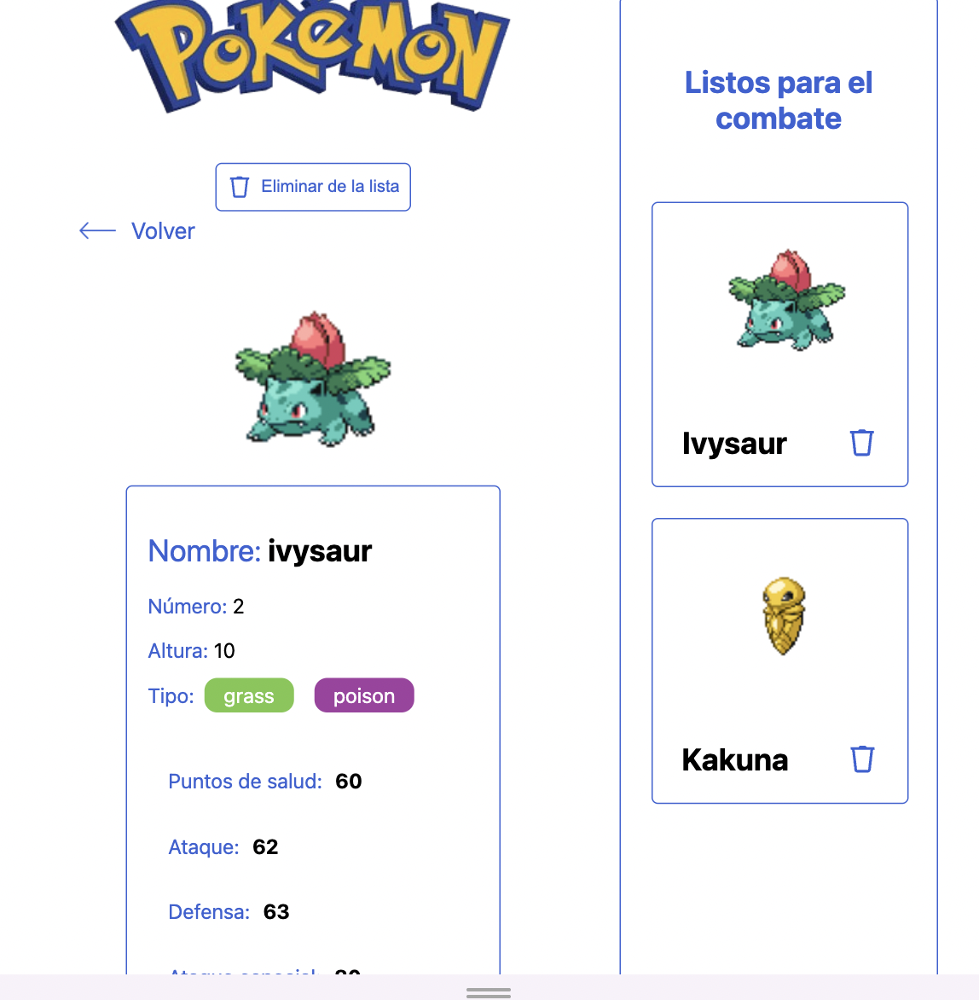

# Wird Challenge

​

## Índice

​

- [FrontEndChallenge](#wird-challenge)
  - [Instalación](#instalacion)
  - [Índice](#índice)
  - [1. Preámbulo](#1-preámbulo)
  - [2. Resumen del desarrollo del proyecto](#2-resumen-del-desarrollo-del-proyecto)
  - [4. Carpetas que encontrarás en el repositorio](#4-carpetas-que-encontrarás-en-el-repositorio)
  - [SRC](#src)
    - [App](#app)
    - [Components](#components)
    - [README](#readme)

​

# Instalación

```bash
git clone https://github.com/loregunner/wird-challenge.git
```

## Instalar dependencias

```bash
yarn install  o npm install
```

```bash
yarn run dev  o npm run dev
```

## 1. Preámbulo

​
Este proyecto tiene como enfoque principal el realizar una visualización de la lista de 151 pokemones, este con la finalidad de conocer acá uno de ellos, también conocer los detalles de sus atasques, defensa, etc.

## 2. Resumen del desarrollo del proyecto

Para la lista de pokemones se trabajo con styled-components, redux, react - vite, se creo un persiste redux para que el usuario no pierda sus pokemones en lista de combate.

## 4. Framework - Librería - Lenguaje

|            | Descripción                                                                                                        |
| :--------- | :----------------------------------------------------------------------------------------------------------------- |
| ReactJS    | Es una librería de JavaScript                                                                                      |
| Vite       | Herramienta de construcción y desarrollo de aplicaciones                                                           |
| Typescript | TypeScript es un superconjunto de JavaScript que añade tipado estático opcional y funciones avanzadas a JavaScript |
| Redux      | Como biblioteca de estado principal                                                                                |

## 5. Carpetas que encontrarás en el repositorio

## SRC

### Api

| Archivo     | Descripción                                                     |
| :---------- | :-------------------------------------------------------------- |
| pokemon.tsx | Archivo donde se encuentra la función de axios para la petición |

### Assets

| Archivo     | Descripción                     |
| :---------- | :------------------------------ |
| [nameImage] | Imagen utilizada en el proyecto |

### Components

| Archivo            | Descripción                                       |
| :----------------- | :------------------------------------------------ |
| DetailPokemon.tsx  | Detalle del pokemon seleccionado por el usuario   |
| ListPokemons.tsx   | Listado total de los pokemones                    |
| Pagination.tsx     | Paginación de la lista de los pokemones           |
| PokemonPrepare.tsx | Listado de los pokemones "Listos para el combate" |

### Features

| Archivo     | Descripción                                                                                          |
| :---------- | :--------------------------------------------------------------------------------------------------- |
| Details.tsx | Visualización de la ruta details, que contiene el detalle del pokemon así como la lista del combate  |
| Home.tsx    | Visualización de la ruta principal, que contiene la lista de pokemones así como la lista del combate |

### Hooks

| Archivo    | Descripción                                  |
| :--------- | :------------------------------------------- |
| [nameHook] | Hooks globales y customizados del responsive |

### Utils

| Archivo     | Descripción                               |
| :---------- | :---------------------------------------- |
| libsSVG.tsx | exportaciones de las imagenes globalmente |

### App

| Archivo | Descripción                 |
| :------ | :-------------------------- |
| App.tsx | Pagína inicial del proyecto |

### README

​
| Archivo | Descripción |
| :-------- | :---------------------------- |
| readme.md | Documentación general del proyecto |

## 4. Look final del proyecto vista de ordenador

​

​

​

## 5. Look final del proyecto vista de tableta




